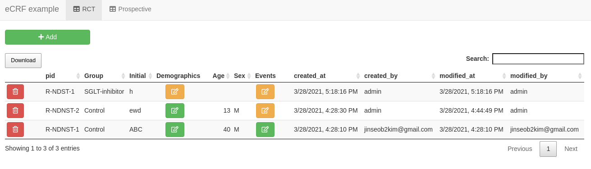
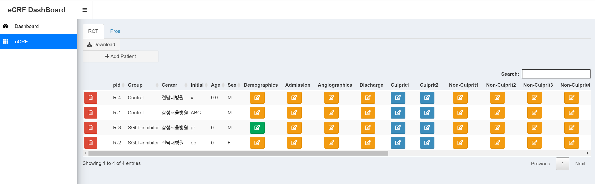
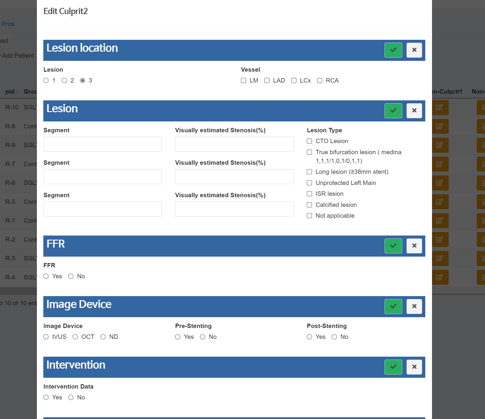
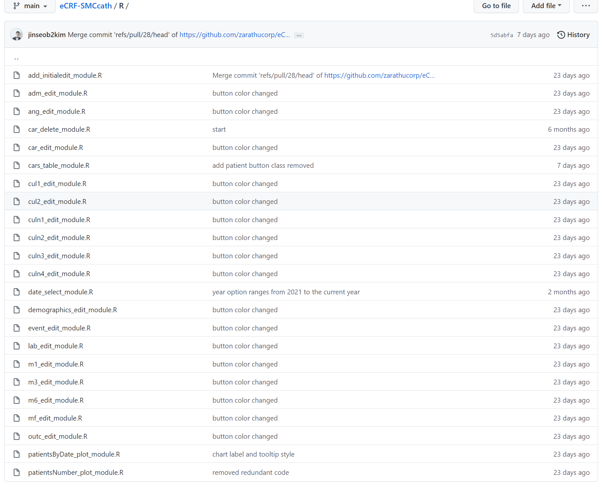
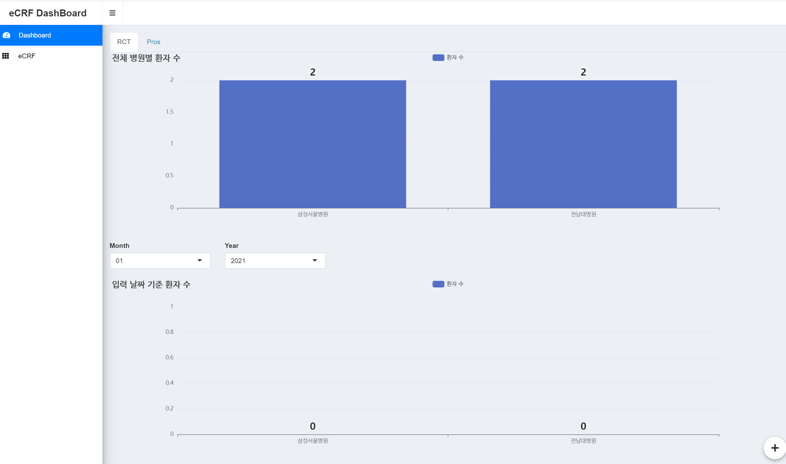
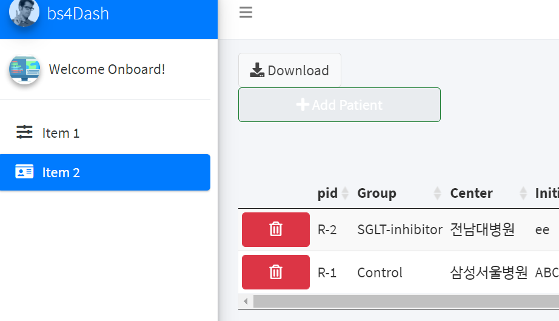
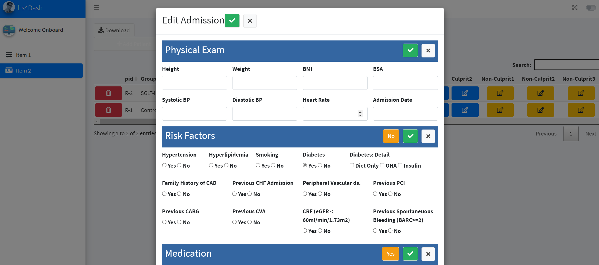

```{r setup, include=FALSE}
options(htmltools.dir.version = FALSE)
knitr::opts_chunk$set(echo = FALSE, fig.align = "center")
library(knitr);library(DT);library(shiny)
```


layout: true

<div class="my-footer"><span><a href="https://www.zarathu.com">Zarathu Co.,Ltd</a>   
&emsp;&emsp;&emsp;&emsp;&emsp;&emsp;&emsp;&emsp;&emsp;&emsp;&emsp;&emsp;&emsp;
&emsp;&emsp;&emsp;&emsp;&emsp;&emsp;&emsp;&emsp;&emsp;&emsp;&emsp;&emsp;&emsp;
<a href="https://github.com/jinseob2kim">김진섭</a></span></div> 


---
# Executive summary

.large[
[4월 발표](https://zarathucorp.github.io/eCRF-SMCcath/shinykorea) 개발완료 후 서비스 중 

- 수백개 변수 추가, 입력화면 디자인 개선(Thanks to [김진환](https://github.com/jhk0530))

- [shinydashboard](https://rstudio.github.io/shinydashboard/) 적용, 환자수 대시보드 추가(Thanks to [고현준](https://github.com/ghj20345))

- [shinymanager](https://github.com/datastorm-open/shinymanager) 로 로그인 모듈: 특정 ID만 삭제권한.

타 연구 빠른적용 위해 모듈화 필요, 설문지 Builder 가능할까?
]


---

# 이전 Executive summary

.large[
삼성서울병원 [심혈관중재실 의뢰](http://www.samsunghospital.com/m/reservation/common/doctorProfile.do?DR_NO=2157): 환자데이터 입력웹(eCRF).

- [Tychobra](https://www.tychobra.com/)의 [Shiny CRUD](https://www.tychobra.com/posts/2020-01-29-shiny-crud-traditional/) 참고해 용병 1인과 개발 중. 

- [shinymanager](https://github.com/datastorm-open/shinymanager) 로 로그인 모듈: 어떤 ID가 생성, 수정했는지 기록. 

- DB: [RSQLite](https://github.com/r-dbi/RSQLite) 이용, 파일로 관리.

- [DT](https://rstudio.github.io/DT/) 사용: proxy 기능으로 빠른 업데이트 가능. 테이블 안에 클릭(수정)버튼 삽입.

- 버튼 1개 당 [shiny module](https://shiny.rstudio.com/articles/modules.html) 1개. 

의료데이터 입력/관리/분석 통합서비스 목표.

]

---
# 이전 $\rightarrow$ 현재





---
# 수많은 변수들..



---
# 모듈당 버튼하나, 질문 수십개




---
# 대시보드 적용: 참여환자 수 추가




---
# [bslib](https://github.com/rstudio/bslib) 적용 실패

.large[
Bootstrap4 안맞는듯
- 버튼 크기, 색깔문제 

- [shinyFeedback](https://github.com/merlinoa/shinyFeedback) 팝업 안뜨는 문제 
]



---
# 전부 굵은글씨..




---
# [shinymanager](https://github.com/datastorm-open/shinymanager) admin

```r
credentials <- data.frame(
* user = c("admin", "user"),
  password = c("adminpass", "userpass"),
  admin = c(T, F),
  stringsAsFactors = FALSE
 )

# create_db(credentials_data = credentials, sqlite_path = "database.sqlite")

server <- function(input, output, session) {
  res_auth <- secure_server(
    check_credentials = check_credentials("database.sqlite")
  )

  # ID: res_auth$user
* callModule(cars_table_module, "table_rct", "rct", sessionid = res_auth$user)
* callModule(cars_table_module, "table_pros", "pros", sessionid = res_auth$user)
}

```

---
# Admin 일때만 delete 활성화 

```r
car_delete_module <- function(input, output, session, modal_title, car_to_delete, modal_trigger, tbl = "rct", sessionid) {
  ns <- session$ns
  # Observes trigger for this module (here, the Delete Button)
  observeEvent(modal_trigger(), {
    # Authorize who is able to access particular buttons (here, modules)
*   req(sessionid == 'admin')

    showModal(
      modalDialog(
        div(
          style = "padding: 30px;",
          class = "text-center",
          h2(
            style = "line-height: 1.75;",
            paste0(
              'Are you sure you want to delete the "',
              car_to_delete()$pid,
              '"?'
            )
          )
        ),
        ...
```

---
# 향후목표

.large[
타연구에도 빠르게 적용
- 흔히쓰는 항목 모듈화해서 코드 한줄로.

- eCRF 빌더. 구글설문처럼 질문 직접 만들어 넣을 수 있도록

분석탭 추가 
- [jsmodule](https://github.com/jinseob2kim/jsmodule)  모듈 적용
]


---
# Executive summary

.large[
[4월 발표](https://zarathucorp.github.io/eCRF-SMCcath/shinykorea) 개발완료 후 서비스 중 

- 수백개 변수 추가, 입력화면 디자인 개선(Thanks to [김진환](https://github.com/jhk0530))

- [shinydashboard](https://rstudio.github.io/shinydashboard/) 적용, 환자수 대시보드 추가(Thanks to [고현준](https://github.com/ghj20345))

- [shinymanager](https://github.com/datastorm-open/shinymanager) 로 로그인 모듈: 특정 ID만 삭제권한.

타 연구 빠른적용 위해 모듈화 필요, 설문지 Builder 가능할까?
]
---

class: center, middle

# END
